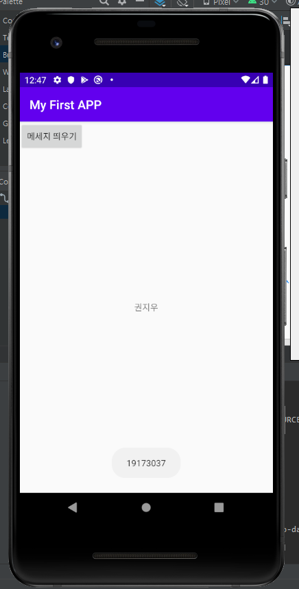
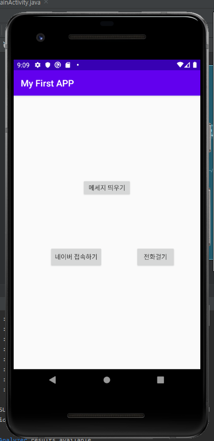
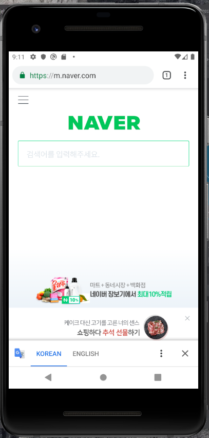
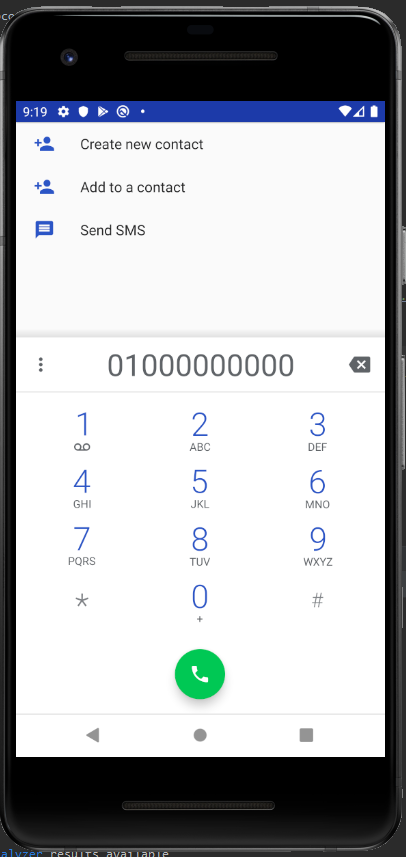

# 19173037_권지우

# 1주차 과제
- 퀴즈
# 2주차 과제
</img>
# 3주차 과제
</img>
</img>
</img>
# 4주차 과제
- 여행시 가장 필요한 부분만 넣은 앱
: 1. 자신의 위치를 알려주고 움직이는 위치까지 잡아내 가까운 거리까지 길 찾기가 용이한 지도
  2. 가장 빠른 경로로 안내하며 택시기사와 대화 시 사용할 번역기능, 전세계 택시예약가능 
  3. 관광명소는 물론 맛집 그리고 관광명소, 맛집, 숙박업소 사용자들만이 남길 수 있는 후기를 활용한 다방면 여행관련후기를 모아둔 자료실
  4. 각 나라의 여행시 알아둬야 할 팁, 문화, 인사, 간단한 언어 등이 들어있는 자료실 
  5. 위험지역, 범죄주의요망 또는 위험시간대 알람
